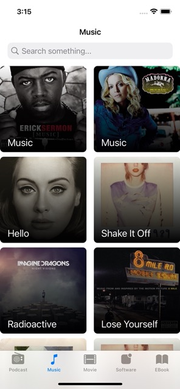
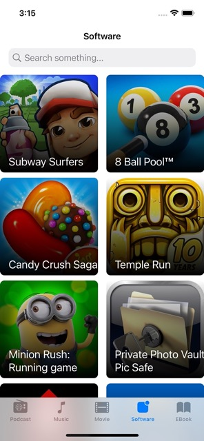
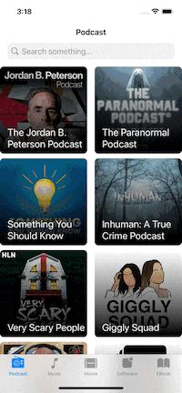
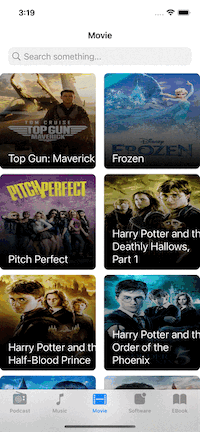

# Pazarama iOS Bootcamp - Hafta 3 - Ödev

## Ekran Görüntüleri
       

## iTunes Client App

Bu haftanın ödev konusu olarak, geliştirdiğimiz iTunes Client App uygulamasını tamamlayacağız. iTunes Search API altında yer alan movie, podcast, music, software, ebook medya tipleri için UITabBarController’a yeni tablar ekleyeceğiz. Ders süresince podcast için bir tab bar eklemiştik. Aynı süreçleri takip ederek diğer tabların eklemesini gerçekleştirebilirsiniz. Her medya tipi için ayrı List/Detail ViewController’lar oluşturabileceğiniz gibi, podcast için oluşturduğumuz ViewController yapılarını daha generic bir hale getirip kullanmanız tavsiye olunur. Tablar değişse de her tab içinde SearchController bulunmalı ve arama sonuçları listelenmelidir. Son olarak bir favoriler tab’i eklenecek ve favorilere eklenen medyalar bu ekranda gösterilercek. Favorilerin kaydı için CoreData kullanılacaktır. Farklı medya tiplerini farklı segmentler altında gösterebilirsiniz. Favorilere eklemek için NavigationBar’a BarButtonItem ekleyebilirsiniz(farklı yöntemler kabul edilecektir.).

## Değerlendirme Kriterleri

1. Uygulamanın sorunsuz bir şekilde(crash free) çalışması.
2. Diğer medya tipleri için tabların eklenmiş olması.
3. UI’ın programmatic(NSLayoutConstraints) olarak oluşturulması.
4. SearchController ile mevcut tabda filtreleme yapılabilmesi.
5. Medyanın favoriler eklenebilmesi ve favoriler ekranında düzgün bir şekilde listelenmesi.

## Faydalı Linkler

- iTunes Search API: https://developer.apple.com/library/archive/documentation/AudioVideo/ Conceptual/iTuneSearchAPI/Searching.html#//apple_ref/doc/uid/TP40017632-CH5-SW1
  
